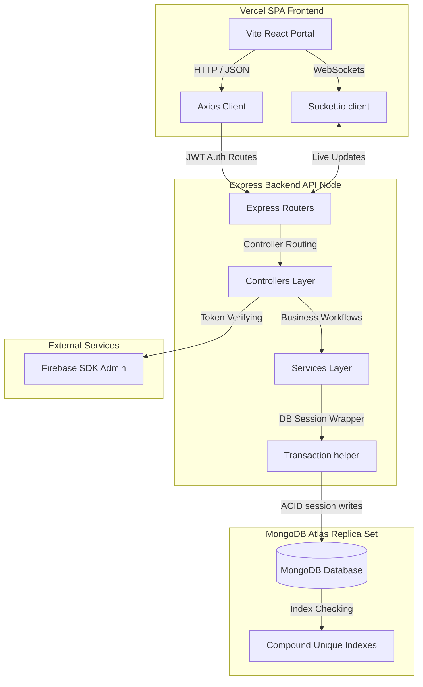
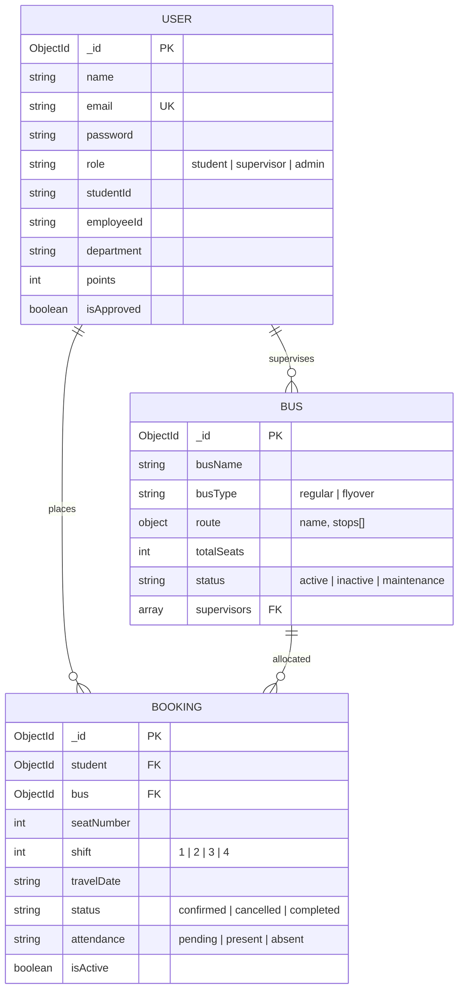
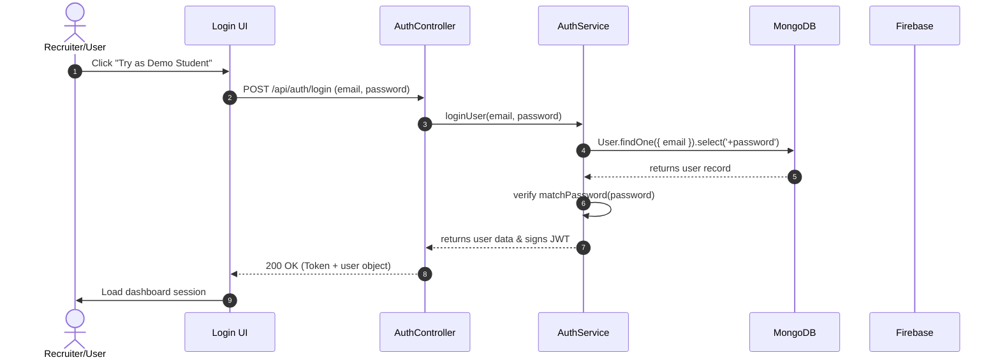
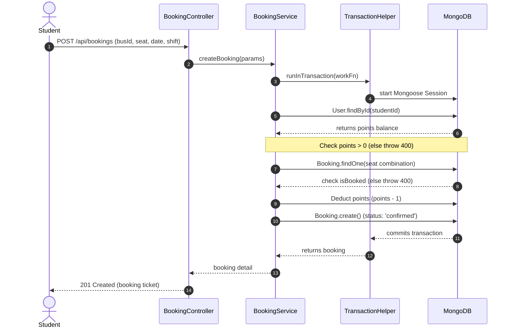
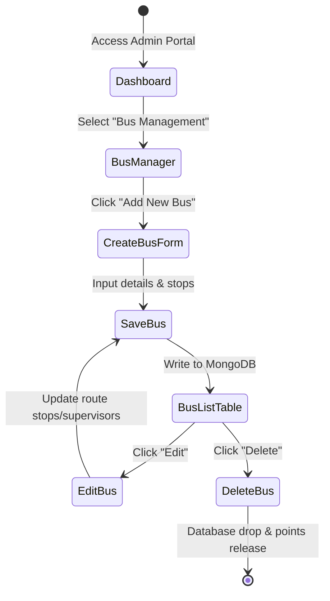

# CUETGo — System Architecture & Design Specifications

This document holds the visual runtime layouts, database diagrams, and API sequence charts for the **CUETGo** booking platform.

---

## 1. System Architecture Diagram

---

## 2. Database Entity Relationship Diagram (ERD)

---

## 3. Authentication Sequence Flow

---

## 4. Transactional Seat Booking Sequence

---

## 5. Admin Panel Bus Management State Flow

